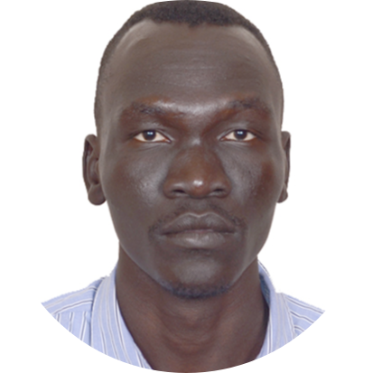

<html/>
<head>
<meta charset="utf-8">
<title>dchol web</title>
<body>
    <table>
        <tr>
            <td></td>
            <td><h1>Daniel
                Chol </h1>
           
<em>
<a href="https://www.iitism.ac.in/">Indian Institute of technology(ISM),Dhanbad</a>

               
<a href="https://www.iitism.ac.in/index.php/Departments/dept_pe">Department of Petroleum Engineering</a>

               
6th semester 

               
International Hostel

               
826004,Dhanbad

            </td>
        </tr>
    </table>
    

    

    
I am a student at IIT(ISM) dhanbad ,currently purusing bachelor's in petroleum engineering ,6th semeseter,the reason 
        behind choosing this course is to learn how to implement the latest known technology in Drilling ,production and reservoir enhancement in away that 
        the Enviroment is not destoryed.coming from these areas where oil is explored and produced ,i have seen lots of misuse 
        and misimplemtaion of safety measures both to the environment and the local residents ,which is causing a risky dreadful health
      hazard,poor <a href="https://www.glossary.oilfield.slb.com/en/Terms/g/gathering_system.aspx">GGS</a> waste disposals which is a result of unwillingness of finding new applied methods
        used currently in this industry.
        Secondly,increasing production,as much is a national concern more it's being mine too.for the good use of these God given natural 
        resourses to the maximum,can yield in building up a stronge economy of the country ,lifting people from poverty 
        and growing a healthy sustainable economy. 
    

</em>

<h3>Education</h3>

    <ul>
        <table>
            <thead>
                <tr>
                    <th>Date</th>
                    <th>School</th>
                    <th>Period</th>
                    <th>certificate</th>
                </tr>
            </thead>
            <tbody>

            </tbody>
            <tfoot>
                <tr>
                    <td>2008-2011</td>
                    <td>Alqiyda Secondary</td>
                    <td>3 years</td>
                    <td>Sudan Certificate</td>
                </tr>
                <tr>
                    <td>2013-2014</td>
                    <td><a href="https://jubauni.net/">Juba University</a></td>
                    <td>2 semesters</td>
                    <td>Geology and Mining</td>
                
                </tr>

                <tr>
                    <td>2016-2021</td>
                    <td><a href="https://www.iitism.ac.in/">Indian Institute of Technology(ISM) Dhanbad</a> </td>
                    <td>10 semester</td>
                    <td>Petroleum Engineering</td>
                </tr>

            </tfoot>

            

        </table>

    </ul>
    <h2>Skills</h2>
    <ol>
    
        <li><a href="https://en.wikipedia.org/wiki/Computer_programming">Computer Programing</a> :
            C++        </li>
        <li><a href="https://dchol122.github.io/The-Coffee-house/">Web Design</a> :
           <em> Html,
            CSS,
            Java script
            </em>
        </li>
        <li<a href="https://scontent.fmaa8-1.fna.fbcdn.net/v/t1.0-9/61584260_1600886550046240_6386366247436550144_o.jpg?_nc_cat=102&_nc_sid=19026a&_nc_oc=AQkW_7LYXi3V3_tI5ZfgYzqLrx6lPitSh6uP3EsL4R5Jg2TcZ8z7nJKmEpyDkDaEajI&_nc_ht=scontent.fmaa8-1.fna&oh=6a21316dde16149d12e7200bbcd76200&oe=5F0651CA">Communication Skills</a></li>
        

    </ol>
    <h2>Hobbies</h2>
    <ol>
        <li><a href="https://www.instagram.com/p/BvhMrpjn92X/?utm_source=ig_web_copy_link">Writting</a></li>

       <li><a href="https://www.instagram.com/p/B66_2f3Hi8T/?utm_source=ig_web_copy_link">Basketball</a></li>
        
    </ol>

<a href="web development3.html">Contact Us</a>

</body>
